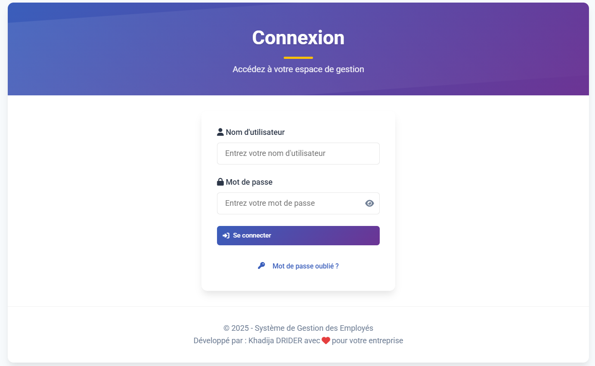
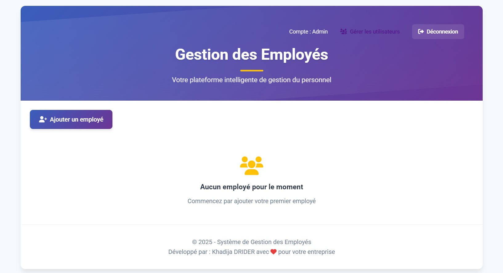
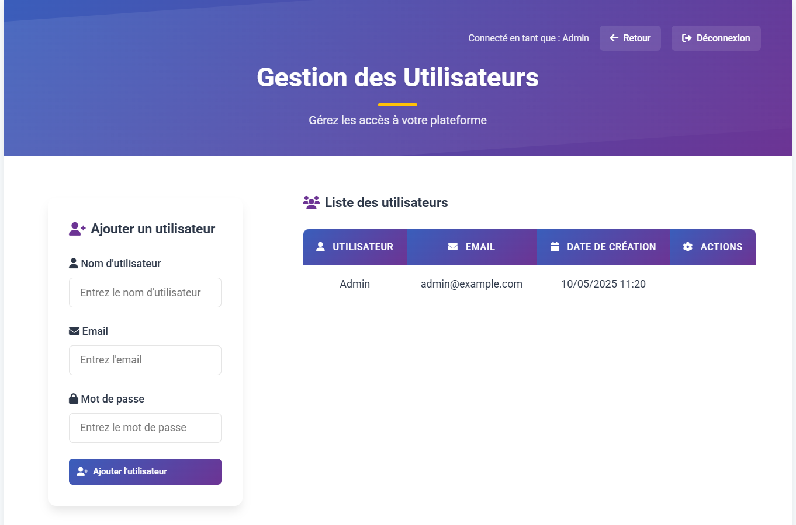

# Système de Gestion des Employés

## 📋 Description
Une application web moderne et intuitive pour la gestion des employés, développée avec PHP (CRUD) et MySQL. Cette application permet de gérer efficacement les informations des employés avec une interface utilisateur élégante et responsive.

## 🌟 Fonctionnalités
- Authentification sécurisée des utilisateurs
- Gestion complète des employés (CRUD)
- Interface utilisateur moderne avec des animations
- Design responsive
- Système de confirmation pour les actions importantes
- Gestion des utilisateurs administrateurs

## 🎨 Interface Utilisateur
### Page de Connexion


### Gestion des employés


### Gestion des utilisateurs


## 🛠️ Technologies Utilisées
- PHP 7.4+
- MySQL 5.7+
- HTML5 & CSS3
- JavaScript
- Font Awesome pour les icônes
- Design responsive avec Media Queries

## 🎯 Caractéristiques Techniques
- Architecture MVC
- Requêtes préparées pour la sécurité
- Hachage sécurisé des mots de passe
- Validation des formulaires
- Sessions sécurisées
- Protection contre les injections SQL
- Interface utilisateur intuitive

## 🚀 Installation

1. Clonez le dépôt :
```bash
git clone [url-du-repo]
```

2. Importez la base de données :
- Créez une base de données nommée 'entreprise'
- Importez le fichier SQL fourni dans le dossier 'database'

3. Configurez la connexion à la base de données :
- Ouvrez le fichier `connexion.php`
- Modifiez les paramètres selon votre configuration :
```php
$DB_HOST = 'localhost';
$DB_USER = 'votre_utilisateur';
$DB_PASS = 'votre_mot_de_passe';
$DB_NAME = 'entreprise';
```

4. Placez les fichiers dans votre serveur web (par exemple, dans le dossier `www` ou `htdocs`)

5. Accédez à l'application via votre navigateur :
```
http://localhost/Gestion des employés
```

## 👤 Compte par Défaut
- Utilisateur : Admin
- Mot de passe : Admin123

## 🔒 Sécurité
- Mots de passe hashés avec `password_hash()`
- Protection contre les injections SQL
- Validation des entrées utilisateur
- Sessions sécurisées

## 📱 Compatibilité
- Chrome (dernière version)
- Firefox (dernière version)
- Safari (dernière version)
- Edge (dernière version)
- Responsive sur mobile et tablette

## 👩‍💻 Développement
Développé par : Khadija DRIDER

## 📄 Licence
© 2025 - Système de Gestion des Employés
Tous droits réservés 